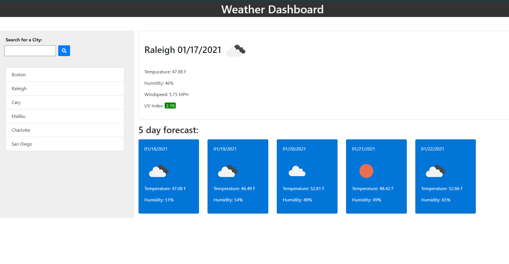

# weather-dashboard
Description: A weather application built from JQuery that calls upon the OpenWeather API to display current weather and 5 day forecast for cities. Searches are saved to local storage, and most recent is redisplayed upon page refresh. 

Installation: None required

Usage: Follow the link https://mautrey17.github.io/weather-dashboard/ to access the weather checker. Type city into the search bar and click the search button to see weather conditions. Previously searched cities can be clicked on to redisplay their data.

